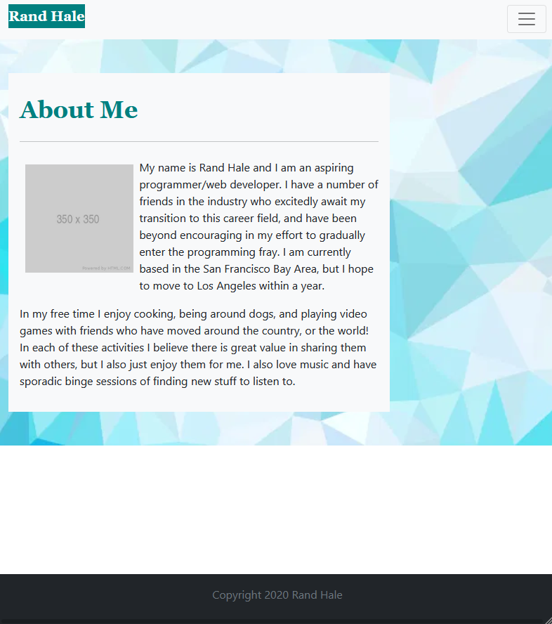
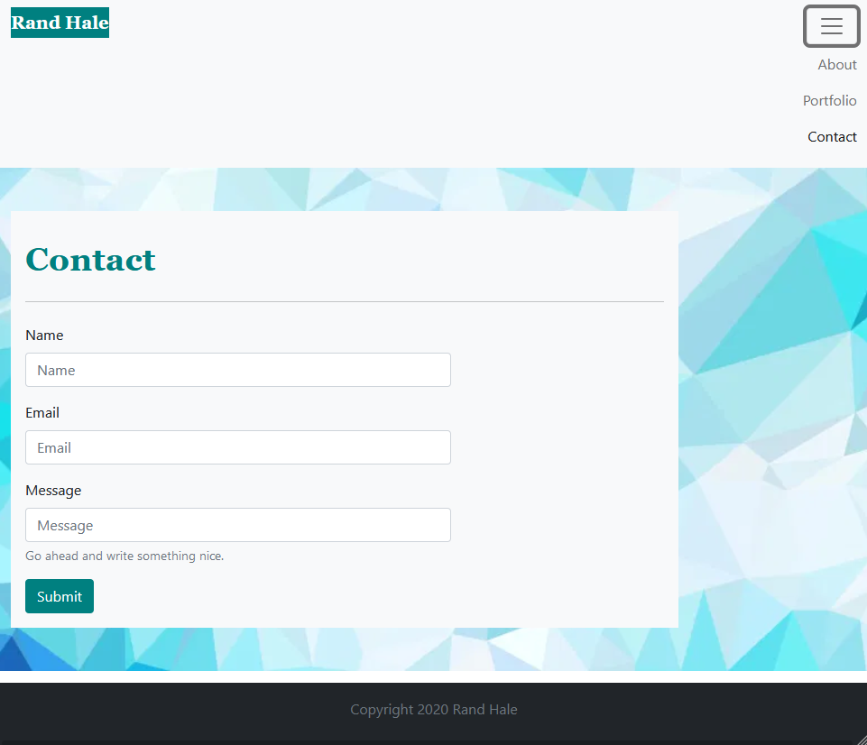
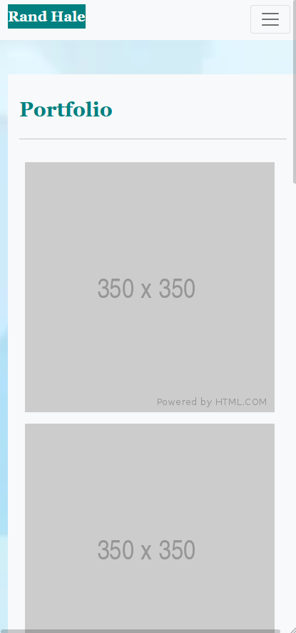
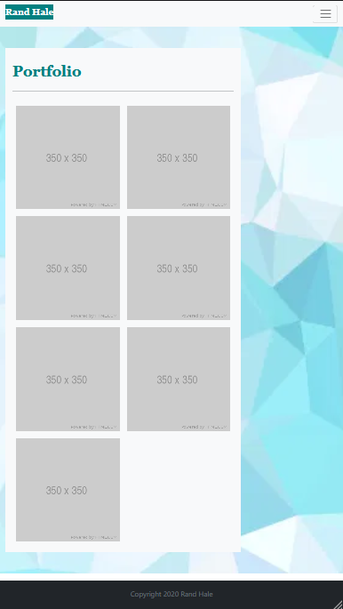
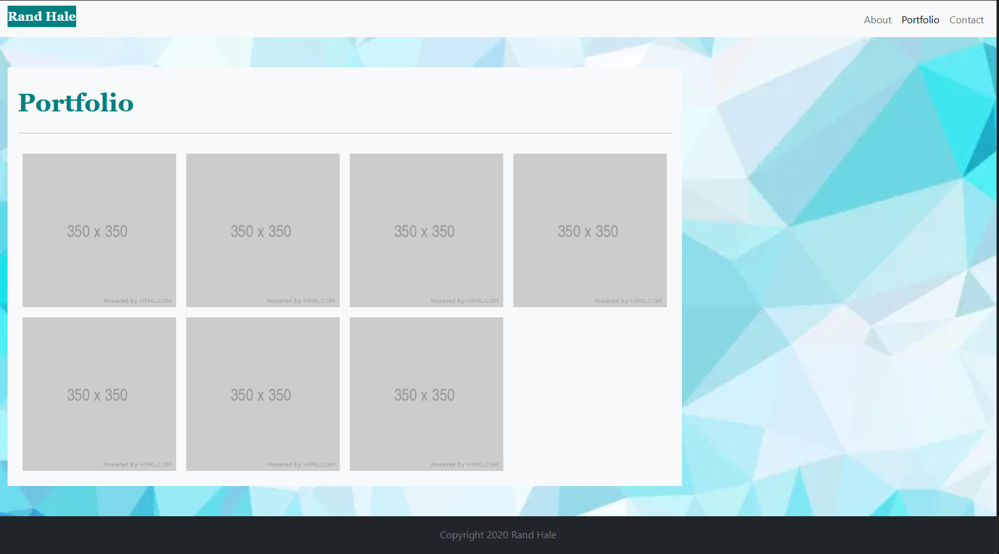

## Rand H Responsive Portfolio

## Description
Hello! This deployed webpage contains a basic layout for a personal portfolio, complete with an About Me section as the homepage, a Portfolio page with placeholder images, and finally a Contact page with a few form fields to fill. The site is almost entirely composed of Bootstrap elements, which behave according to assigned class tags that correspond to the Bootstrap service's stylesheet and javascript. Two major advantages of using Bootstrap to create this page were:
* The predetermined CSS styles that I could use with predictable outcomes and nice visual styling.
* The responsiveness of Bootstrap elements to different screen sizes, allowing me to quickly create mobile-compatible webpages.
Please enjoy exploring the site! The links in the Navigation bar at the top of the screen can be used to navigate to each of the three pages.

## Table of Contents
* [Technologies Used](#technologies-used)
* [How to Access](#how-to-access)
* [What I Did](#what-i-did)
* [Code Snippets](#code-snippets)
* [Acknowledgments](#acknowledgments)
* [Who I Am](#who-i-am)

---

## Technologies Used
* [HTML](https://www.w3schools.com/html/) to structure the "skeleton" of the webpage and its elements.
* [CSS](https://www.w3schools.com/css/) for visual styling to make that HTML much prettier.
* [Bootstrap](https://getbootstrap.com/) for its library of HTML elements and corresponding CSS styles and JS scripts.
* [Git](https://git-scm.com/) for distributed version control, tracking changes over time and making them visible to collaborators.
* [Github](https://github.com/) for version control in the cloud, saving my changes and presenting them clearly to myself and others.

## How to Access
* [Click here](https://prophetrand.github.io/my-responsive-portfolio/) to view the full responsive portfolio.

---

## What I Did
To construct this HTML webpage I used predefined styles and classes provided by Bootstrap to arrange, format, and visually touch-up every element present on the page. I created a style.css stylesheet in order to adjust the fonts and text or background colors of a few headers and the background color of a "Submit" button, which was useful for choosing my color by hexcode and keeping it consistent between elements. Aside from these stylings, everything else was styled using Bootstrap! 

A navigation bar sits at the top of the screen at all times, and contains links to each page of the portfolio. If the screen becomes small enough, the list of links will become an interactive dropdown menu. 

The contents of each page exist inside containers with rules I have set for them to change size according to the size of the webpage, which the Bootstrap elements register by width of the window/screen viewing the page. I used standard breakpoints provided by Bootstrap to adjust sizing to extra-small, small, medium, and large screens. This adaptability is a huge merit of Bootstrap.

There is also a footer element that will always be at the bottom of the page, and this property is once again defined using Bootstrap classes.

## Code Snippets 
In the code snippet below, the main contents of the Portfolio page are depicted. The entire division is assigned the class "row" to group the elements together, separating them vertically from other rows surrounding this division. The container (and everything contained inside) is told what its background color should be with the "bg-light" class, its horizontal space occupied by everything larger than a small screen with "col-sm-8" and for extra-small screens with "col-11", its horizontal margin sizes with "mx-4", and its padding on all sides with "p-3." Each of these values can be adjusted but can have profound effects on the visual styles *especially* when the window/screen size changes.
```
<div class="row">
            <div class="container-sm bg-light col-sm-8 col-11 mx-4 p-3">
            
            <h2 class="fs-1 fw-bold pt-3">Portfolio</h2>
            <hr class="my-4"/>

            

            

            

            

            

            

            

            </div>
        </div>
```
The images used are only placeholders, but in their class tags they are also arranged deliberately. "float-start" causes the elements to be placed on the left side of the screen by default. "col-md-6" tells the image how large to be when the screen is a medium size or smaller, while "col-lg-3" controls their position when the screen size is above the medium breakpoint.

## Screenshots
Shown here is the appearance of the Home/About Me page when viewed on a Medium screen.



This image below shows the appearance of the Contact page on a Medium screen, with the navigation dropdown menu clicked/engaged.



Here is the appearance of the Portfolio page viewed on a Small screen.



And a Medium screen!



And a Large screen! Here one can see how the navigation menu extended as a horizontal list rather than a dropdown menu.


---

## Acknowledgments
* HTML for each page was validated using the [W3C](https://validator.w3.org/) Markup Validation Service.
* [Bootstrap](https://getbootstrap.com/) deserves another shout-out for how extensively I used it to build out the entire site... its elements, stylings, spacings, everything!

## License
Bootstrap is available under the MIT License and is copyrighted in 2020 to Twitter. The details of the license can be read [here](https://github.com/twbs/bootstrap/blob/v5.0.0-beta1/LICENSE).

## Who I Am
My name is Rand Hale, and I am an aspiring programmer/web developer based in California.

* [LinkedIn](https://www.linkedin.com/in/rand-hale-83ba389b/)
* [Portfolio](https://prophetrand.github.io/prework-about-me/)